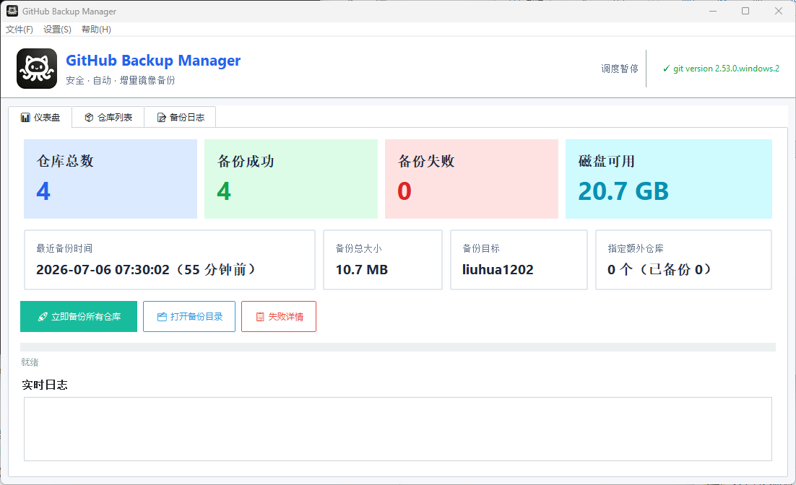
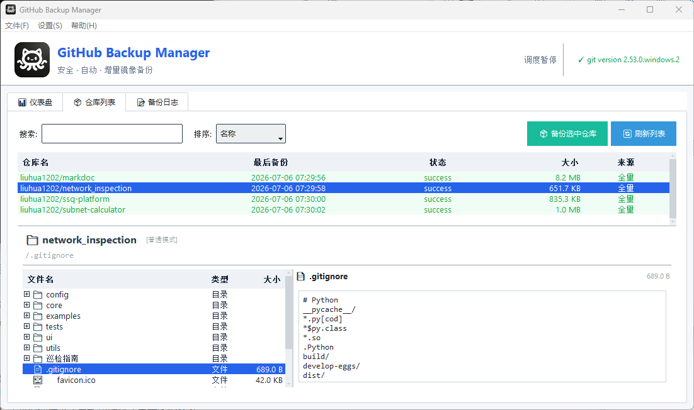
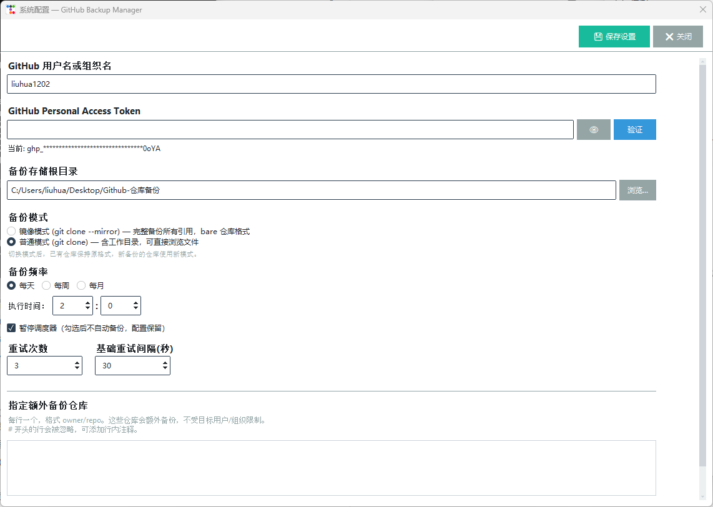

# GitHub Backup Manager · GitHub 仓库桌面备份工具

[](#-v121-变更摘要)
[](#-许可证)
[](#-特性)
[](https://www.python.org/)
[](https://github.com/israel-dryer/ttkbootstrap)

基于 Python + Tkinter 的 GitHub 仓库定时备份桌面工具。支持**镜像 / 普通双模式克隆**、
APScheduler 定时调度、Token 安全脱敏、嵌入式 IDE 风格文件浏览器；Windows / macOS / Linux
三平台开箱即用。

> ⚠️ **前置依赖：必须先安装 Git 才能使用本软件**
>
> 本工具本质上是 Git 备份命令的图形界面 —— 所有 `clone / fetch / fsck / pull` 都依赖系统里的 `git` 命令。
> 没装 Git 就启动会弹出警告对话框，且**实际备份功能无法运行**。
>
> 安装方法：
>
> | 平台 | 安装命令 / 链接 |
> | :--- | :--- |
> | Windows | https://git-scm.com/download/win （下载安装包一路 Next 即可） |
> | macOS | `brew install git` 或安装 Xcode Command Line Tools：`xcode-select --install` |
> | Linux (Debian / Ubuntu) | `sudo apt update && sudo apt install git` |
> | Linux (Fedora / RHEL) | `sudo dnf install git` |
> | Linux (Arch) | `sudo pacman -S git` |
>
> 装好后启动软件，**窗口右上角**会显示 `✓ git version x.y.z` 验证是否识别成功；显示 `⚠ 未检测到 git` 则功能受限。

<p align="center">
  
</p>
<p align="center"><em>仪表盘 —— Metro 磁贴风指标卡片（顶部 10px accent 描边 + 浅 accent 圆角底）+ 仓库总数 / 备份成功失败 / 磁盘可用 / 备份目标 / 实时日志</em></p>

<p align="center">
  
</p>
<p align="center"><em>仓库列表 —— 搜索 / 排序 / 嵌入式文件浏览器（双击预览 .gitignore 等）</em></p>

<p align="center">
  
</p>
<p align="center"><em>系统配置 —— Token 脱敏 / 双克隆模式 / 频率 / 重试参数 / 指定额外仓库</em></p>

更多截图见 [`docs/screenshots/`](./docs/screenshots)。

---

## ✨ 特性

### 🎯 备份核心
- 🪞 **双克隆模式**：镜像 (`git clone --mirror`，bare 仓库) 与普通 (`git clone`，含工作目录) 可切换，老仓保持原格式，新仓按选定模式
- 🔄 **增量更新**：首次 `clone --mirror`，后续 `git fetch --all --prune --tags`，ref / tag 同步 + 远端删除
- ✅ **完整性自检**：每次镜像备份后跑 `git fsck`，失败仓库单独打 `fsck_failed` 标记
- 🔁 **指数退避重试**：GitHub API 与 git 命令失败自动重试（次数 / 基础间隔可配）
- ⏹ **真打断**：取消时 200ms 内 `proc.terminate()` 子进程，不用等当前仓库跑完

### 🖥️ 现代化 GUI
- 📋 **顶部菜单栏**：文件 / 设置 / 帮助三大类，所有功能入口一目了然
  - **文件**：立即备份所有 / 备份选中 / 刷新 / 取消 / 打开备份目录 / 查看日志 / 失败详情 / 退出
  - **设置**：系统配置…（Toplevel 对话框） / 暂停调度器 / 重新初始化 / 重置备份状态
  - **帮助**：关于… / 系统定时任务参考（Windows / macOS / Linux）/ 打开备份目录
- ⚙️ **频率 UI 同行布局**：HH:MM spinner + 右侧周几/几号下拉，三模式（每天/每周/每月）切换零卡顿
- 📊 **三 tab**：仪表盘（指标卡片 + 日志预览） / 仓库列表 / 备份日志

### ⏱ 调度
- **每天 / 每周 / 每月**：内置 APScheduler 后台驱动
- **每周**：选周几（mon-sun）
- **每月**：选几号（1-31，下拉菜单）
- **每年 / 自定义 Cron**：模型层保留兼容（老 config 不崩），UI 已精简为三个常用模式

### 🛡️ 安全
- 🔐 **Token 注入**：走 `git -c http.extraheader=Authorization: Basic <base64>`，不进 argv / ps
- 🛡️ **本地 JSON chmod 600**：仅本机可读，`.gitignore` 默认排除 `config.json`
- 👁 **密码框 + 显示切换**：默认隐藏，明文按钮一键切换
- 🎭 **日志脱敏**：URL 中带 token 自动掩码

### 🧰 运维
- 📁 **嵌入式文件浏览器**：目录树懒加载 + 文件预览（5MB 上限、二进制自动识别），兼容 bare / 普通两种格式
- 📋 **失败详情弹窗**：所有失败仓库列表 + 错误详情 + 批量重试入口
- 🗂 **右键上下文菜单**：复制 owner/repo / 在文件管理器打开 / 备份此仓库
- 📝 **完整日志系统**：会话内存缓冲 + 完整日志文件双视图，**按级别着色**（成功绿/失败红/警告橙），搜索 / 导出 / 清空

### ⌨ 快捷键 / 命令行
| 快捷键 | 动作 |
| :--- | :--- |
| `Ctrl+R` | 立即备份所有仓库 |
| `F5` | 刷新仓库列表 |
| `Ctrl+L` | 切换到日志 tab |
| `Ctrl+,` | 打开系统配置对话框 |
| `F1` | 关于 |

命令行模式 `--cron-job` 供系统级 cron / systemd / launchd / Task Scheduler 调用，无头服务器友好。

### 🩺 工具
- **`diagnose.py`**：依赖检查、Git 检测、配置加载、GUI 初始化逐项验证，便于排查启动问题
- **窗口状态持久化**：位置 + 大小保存到 `~/.github_backup_manager/ui_state.json`，下次启动恢复

---

## 📦 下载

前往 [Releases 页面](https://github.com/liuhua1202/GitHub-Backup-Manager/releases) 下载最新版：

| 平台 | 文件 | 大小 | 说明 |
| :--- | :--- | :--- | :--- |
| Windows | `GitHub-Backup-Manager-v1.2.1-windows-x86_64.zip` | ~10 MB | 单文件可执行，解压即用 |
| macOS | `Source code (zip)` | — | 暂未提供 macOS 二进制（PyInstaller 需跨平台编译） |
| Linux | `Source code (tar.gz)` | — | 同上 |

### v1.2.1 SHA256

```
BD5CC0B80A379AB1FA2D2B9A3CC6C53A7F94C96436ABD9B547927B9822A263C9  GitHub-Backup-Manager-v1.2.1-windows-x86_64.zip
```

---

## 🚀 快速开始

### 直接跑源码（所有平台通用）

```bash
git clone https://github.com/liuhua1202/GitHub-Backup-Manager.git
cd GitHub-Backup-Manager
pip install -r requirements.txt
python app.py
```

> **需要 Python 3.10+，并先安装好 Git**（详见上方 ⚠️ 前置依赖）。

### Windows 单文件版

下载 `GitHub-Backup-Manager-v1.2.1-windows-x86_64.zip` → 解压 → 双击 `GitHubBackupManager.exe` 运行。

启动后弹出首次设置向导：

1. **目标**：填 GitHub 用户名或组织名（如 `torvalds`）
2. **Token**：填 Personal Access Token（Settings → Developer settings → Personal access tokens，需要 `repo` 权限）
3. **备份目录**：选个文件夹存镜像（建议非系统盘）
4. **备份频率**：选每天 / 每周 / 每月，选执行时间和具体日期
5. 完成后调度器会自动启动，按设定的节奏备份

---

## ⚙ 配置

所有配置存于 `./config.json`（**已在 `.gitignore` 中，请勿提交**），可以通过 UI 编辑，也可以手动改 JSON：

```json
{
  "target": "your-github-username",
  "token": "ghp_xxx",
  "backup_dir": "D:\\github-backups",
  "schedule_type": "daily",
  "daily_hour": 2,
  "daily_minute": 0,
  "weekly_day_of_week": "sun",
  "monthly_day_of_month": 1,
  "extra_repos": ["octocat/Hello-World"],
  "clone_mode": "mirror",
  "retry_count": 3,
  "retry_delay_base": 10
}
```

完整字段含义参考 [`config.json.example`](./config.json.example)。

---

## 🛡 隐私保护

| 数据 | 处理 |
| :--- | :--- |
| GitHub Token | 走 `-c http.extraheader` 注入命令行，**不进 argv**；不写日志；本地 `chmod 600` |
| 备份目录 | 用户自选，本机磁盘，不上传 |
| 调度日志 | 仅本地 `logs/backup.log`，无网络上报 |
| `config.json` | **`.gitignore` 强制排除**，仓库提交前会自动跳过 |

如果你意外提交过 Token，**立即撤销**：https://github.com/settings/tokens —— 旧 Token 立即失效。

---

## 📐 系统级定时任务参考

> 帮助 → 系统定时任务参考 菜单里有完整三平台示例，这里只概览：

| 平台 | 推荐方案 | 配置位置 |
| :--- | :--- | :--- |
| Windows | Task Scheduler + `.bat` | 任务计划程序 → 创建基本任务 |
| macOS | launchd (`~/Library/LaunchAgents/*.plist`) | `launchctl load / unload` 注册 |
| Linux | cron / systemd timer | `crontab -e` 或 `/etc/systemd/system/github-backup.{service,timer}` |

> 一般情况下内置的 APScheduler 调度器足够用（只要本机不长期休眠）；需要 24×7 可靠运行才上系统级方案。

---

## 🔨 从源码构建 Windows 单文件 exe

```bash
pip install pyinstaller
pyinstaller --onefile --windowed --name GitHubBackupManager \
            --icon "logo.ico" \
            --add-data "logo.ico;." app.py
```

产物在 `dist/GitHubBackupManager.exe`，可直接分发。

---

## 📝 日志

- 应用日志：`logs/backup.log`（按天滚动，DEBUG 级）
- 操作日志：UI 内嵌的实时日志缓冲（成功绿 / 错误红 / 警告橙 三色着色）

---

## 🐛 故障排查

跑 `python diagnose.py` 逐项检查依赖 / Git / 配置 / GUI 初始化。

遇到问题先看这里的清单：

| 症状 | 检查 |
| :--- | :--- |
| 启动闪退 | `python diagnose.py` 看依赖 |
| 右上角显示 `⚠ 未检测到 git` | 系统未安装 Git 或 PATH 没包含 git，按上文安装 |
| Token 失败 | Token 是否有 `repo` 权限；目标用户是否设置了 Token 可见性 |
| 备份卡住 | `git fetch --prune` 网络问题；日志会显示具体仓库 |
| 调度器不跑 | 设置 → 暂停调度器 是否被勾选 |
| 找不到 `config.json` | 路径在 Windows 可能被杀毒软件隔离 |

---

## 🆕 v1.2.1 变更摘要

相对 v1.2.0：
- ⚡ **启动速度优化 -35%**：`BackupApp()` 主线程构造从 1.30s 降到 0.85s，用户感知的主窗口可见时间从双击后 1.3s 提前到 0.85s
  - `check_git` 异步化：原同步 `subprocess.run("git", "--version")` 阻塞 ~149ms，后台 daemon thread 跑，结果通过 `queue.Queue` 通知主线程刷新 header
  - `get_dir_size` 异步化：仪表盘"备份总大小"原本同步扫盘 ~65ms（100MB+ 仓库更久），后台 thread 算完回填
  - 新增 `_async_results: queue.Queue` + `_drain_async_results()` 轮询机制：解决 Tk `after()` 跨线程不安全问题
  - 占位符「检测中…」/「计算中…」让用户立即看到内容，~300ms 后回填真实值
  - 核心功能 0 改动（备份引擎 / 调度器 / UI 控件 / 对话框 / 日志系统全部保留）
- 📝 **CHANGELOG / README** 同步更新

## 🆕 v1.2.0 变更摘要

相对 v1.1.0：
- 🎨 **仪表盘指标卡片重做**（Metro 磁贴风）
  - 顶部 10px accent 描边（粗，凸显卡片语义）
  - 卡片底色 = accent 浅色版（Tailwind 100）
  - 4 边 6px 圆角
  - 数值字色 = accent 色（与顶部联动）
  - 卡片间距 padx 10
- 🛠 **`_metric_card` 重写为 Canvas 像素级自绘**：绕开 ttkbootstrap Canvas bg 覆盖问题，4 个 PIESLICE + 中心矩形组合实现圆角
- 🐛 **修窗口 resize 后仪表盘文字消失**：resize handler 重画时用 `tag_raise` 重建 z 顺序
- 🐛 **修「失败 = 0」误标红**：`final_level` 显式按 `fail_count > 0` 决定
- 🐛 **修 Windows 高 DPI 下 1px 边框不可见**：用 ttk `relief="solid", borderwidth=2`
- 📝 **CHANGELOG / README** 同步更新

## 🆕 v1.1.0 变更摘要

相对 v1.0.0：
- 🎨 **顶部菜单栏**：文件 / 设置 / 帮助 三级菜单，所有功能统一入口
- ⚙️ **设置改为菜单驱动对话框**：原来 Notebook Tab 形式的设置页 → 设置 → 系统配置… Toplevel 弹窗
- 🔁 **取消粒度升级到子进程**：`proc.terminate()` 200ms 内打断正在跑的 `git clone / fetch / pull / fsck`（之前只到下一个仓库边界）
- 📐 **频率 UI 同行布局**：HH:MM + 周几 / 几号 下拉菜单同行右侧（之前独立一行）
- ❌ **移除 UI 中的「每年」和「自定义 Cron」选项**：模型层保留兼容，老 config 不崩
- 🩺 **修 _on_close 备份中提示**：避免不留痕迹地强 kill 子进程
- 🐛 **修 diagnose.py 中 `ttkbootstrap.__version__` AttributeError**：换 `importlib.metadata`
- 🔧 **修 Tk 回调异常静默吞掉**：button 报错现在写入日志 + stderr
- 🛠 **DRY 清理**：`_get_text_widget` 提到模块级；`_infer_level` 移除永不命中的英文关键字
- 📝 **README / config.json.example / CHANGELOG** 同步更新

---

## 📄 许可证

MIT License — 详见 [LICENSE](./LICENSE)。

---

## 🤝 致谢

- [ttkbootstrap](https://github.com/israel-dryer/ttkbootstrap) — 现代 Tkinter 主题
- [APScheduler](https://github.com/agronholm/apscheduler) — 进程内定时调度
- [Pillow](https://github.com/python-pillow/Pillow) — logo 高质量缩放
